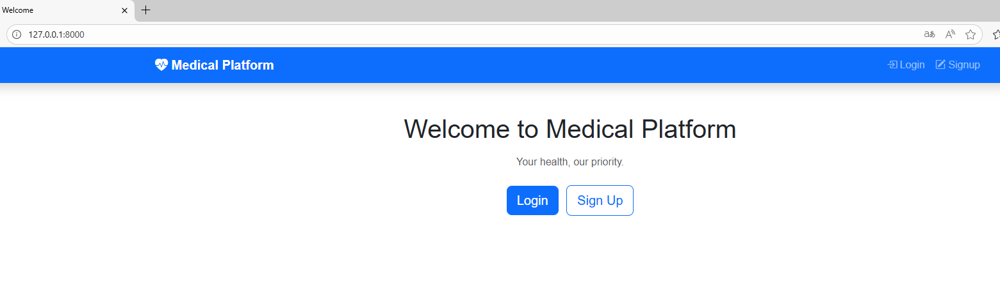
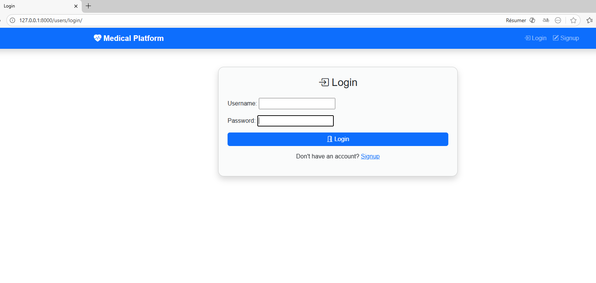
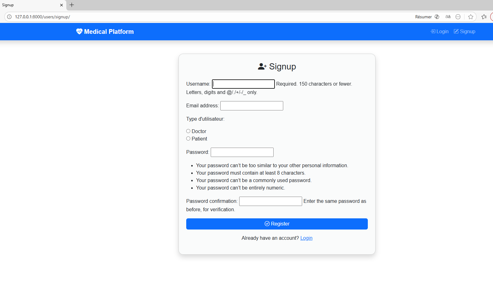

# Medical Platform 🏥

A full-stack web application built with **Django** designed to simplify medical clinic management by connecting patients with doctors for seamless appointment scheduling.

## 🚀 Key Features

* **User Authentication**: Secure Login and Signup system with specific roles for Doctors and Patients.
* **Patient Dashboard**: Patients can easily book appointments by selecting a doctor, date, and time.
* **Doctor Dashboard**: Doctors can view their schedule and manage appointments by approving or rejecting requests.
* **Real-time Status Updates**: Appointment status updates (Pending, Approved, Rejected) are handled via Django logic.

## 🛠️ Tech Stack

* **Backend**: Python / Django.
* **Frontend**: HTML5, CSS3, Bootstrap.
* **Database**: SQLite.

## 📸 Project Screenshots

### 1. Home & Authentication
| Welcome Page | Login Page | Signup Page |
| :--- | :--- | :--- |
|  |  |  |

### 2. Patient Experience
| Patient Dashboard | Booking Form |
| :--- | :--- |
|  |  |

### 3. Doctor Experience
| Doctor Dashboard | Appointment Management |
| :--- | :--- |
|  |  |

## ⚙️ Installation & Setup

1. **Clone the repository**:
   ```bash
   git clone [https://github.com/Amal-hammouda/Medical-Platform.git](https://github.com/Amal-hammouda/Medical-Platform.git)
